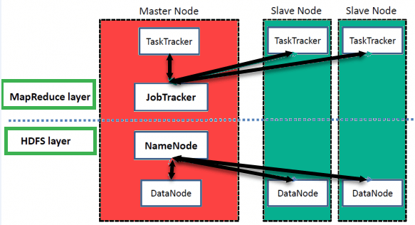

# OVERVIEW HADOOP

  

    
  

## Hadoop ???

  Hadoop là open source apache framework được dùng để phát triển các ứng dụng
xử lý big data thức thi trong hệ thống phân tán.

  Hadoop được thiết kế để mở rộng quy mô từ một máy chủ đơn sang nhiều máy khác
có tính toán và có lưu trữ cục bộ `(local computation and storage)`.

## Hadoop EcoSystem and Components

  

    
  

  Hadoop bao gồm 2 dự án con:
  * **Hadoop MapReduce**: Là 1 framework dùng để viết chương trình có khả năng
  xử lý song song các dữ liệu lớn trên các nodes.
  * **Hadoop Distributed File System (HDFS)**: Là hệ thống file phân tán, cung
  cấp khả năng lưu trữ dữ liệu khổng lồ và tính năng tối ưu hoá việc sử dụng
  băng thông giữa các node. HDFS có thể được sử dụng để chạy trên một cluster
  lớn với hàng chục ngàn node

## Hadoop Architecture

  

    
  

  #TODO

[me](https://ductn.info/about)
